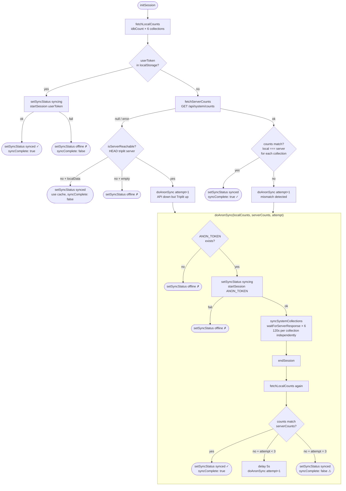

# initSession — Flow Diagram

## Collections tracked
`nutrients`, `foods`, `foodPortions`, `foodNutrients`, `dailyNorms`, `dailyNormItems`

## Timeouts
| | |
|---|---|
| Health check | 2 000 ms |
| Sync per collection | 120 000 ms (2 мин, независимо) |
| Server counts fetch | 5 000 ms |
| Retry delay | 5 000 ms |
| Max retry attempts | 3 |

## Session modes
| Mode | Stays connected? |
|---|---|
| `user` (JWT in localStorage) | yes — persistent session |
| `anon` | no — connect → sync → verify → disconnect (retry if needed) |

## Sync Progress states (per collection)
| State | Meaning |
|---|---|
| `pending` | Waiting to start |
| `syncing` | Subscription active, waiting for onRemoteFulfilled |
| `done` | onRemoteFulfilled received |
| `timeout` | 120s elapsed without onRemoteFulfilled |
